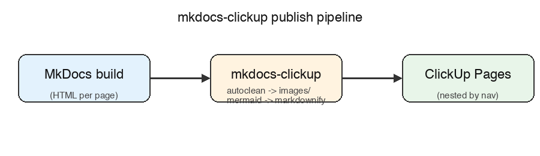
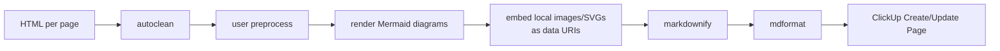

# How it works

`mkdocs-clickup` runs in two stages: converting each MkDocs page's rendered
HTML into Markdown as the site builds, then publishing that Markdown to
ClickUp Pages once the build finishes.

## Publish pipeline



Each page's HTML goes through a fixed conversion pipeline before it's handed
to ClickUp's Create/Update Page API:



- **autoclean** strips MkDocs/theme cruft (permalinks, decorative emoji and
  `:material-*:` icon shortcodes, tab labels) - real content images and SVGs
  are left alone.
- **Mermaid diagrams** (a `` ```mermaid `` fenced code block) are rendered
  locally to an image, if the optional `mermaid` extra is installed;
  otherwise the block is published as plain code.
- **Local images and content SVGs** are read from disk (or serialized, for
  inline SVGs) and embedded directly as `data:` URIs - no dependency on the
  site being deployed.

## Navigation hierarchy mapping

Every MkDocs `nav` section becomes a ClickUp parent page, so a section's
member pages point at it via `parent_page_id`:

<svg viewBox="0 0 420 200" xmlns="http://www.w3.org/2000/svg" role="img" aria-label="guide/index.md is the parent of guide/other.md via parent_page_id">
  <defs>
    <marker id="how-it-works-arrow" markerWidth="10" markerHeight="10" refX="5" refY="5" orient="auto">
      <path d="M0,0 L10,5 L0,10 z" fill="#333333"></path>
    </marker>
  </defs>
  <rect x="10" y="10" width="200" height="50" rx="8" fill="#e3f2fd" stroke="#333333" stroke-width="2"></rect>
  <text x="110" y="40" text-anchor="middle" font-size="14">guide/index.md</text>
  <rect x="230" y="80" width="180" height="40" rx="8" fill="#fce4ec" stroke="#333333" stroke-width="2"></rect>
  <text x="320" y="105" text-anchor="middle" font-size="13">parent_page_id</text>
  <rect x="10" y="140" width="200" height="50" rx="8" fill="#e8f5e9" stroke="#333333" stroke-width="2"></rect>
  <text x="110" y="170" text-anchor="middle" font-size="14">guide/other.md</text>
  <line x1="110" y1="60" x2="110" y2="140" stroke="#333333" stroke-width="2" marker-end="url(#how-it-works-arrow)"></line>
</svg>

If the section has no `index.md`/`README.md` child, an empty placeholder
page is created to anchor it instead - see
[Known limitations](index.md#known-limitations) for the full behavior.
